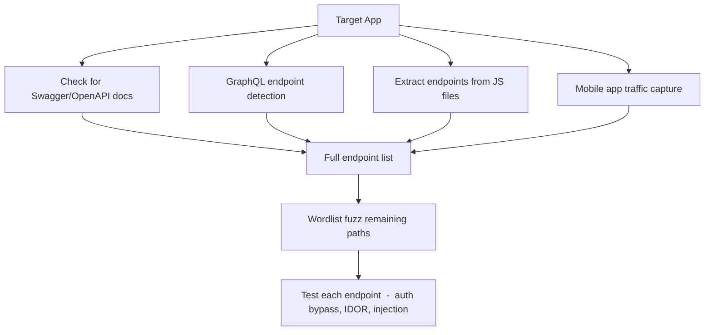

Modern apps are API-first. The web frontend is often just a thin wrapper over the same endpoints the mobile app uses  -  and those mobile endpoints are frequently less hardened than the web surface. Finding the full API attack surface, including undocumented and legacy endpoints, is where I spend most of my time on modern targets.

## Finding API Documentation

Start by looking for self-documenting endpoints. Many teams expose these without realizing it's a recon gift.

# Common Swagger/OpenAPI paths
for path in \
  /swagger \
  /swagger-ui \
  /swagger-ui.html \
  /swagger.json \
  /swagger.yaml \
  /api-docs \
  /api-docs/swagger.json \
  /openapi \
  /openapi.json \
  /openapi.yaml \
  /v1/swagger \
  /v2/swagger \
  /v3/swagger \
  /api/v1/swagger.json \
  /docs \
  /redoc \
  /api/redoc \
  /internal/swagger; do
  code=$(curl -s -o /dev/null -w "%{http_code}" "https://target.com$path")
  [ "$code" != "404" ] && echo "$code $path"
done
If you find a Swagger or OpenAPI spec, extract every endpoint from it:

# Parse OpenAPI JSON for all paths
curl -s https://target.com/openapi.json | \
  python3 -c "
import json, sys
spec = json.load(sys.stdin)
base = spec.get('servers', [{'url': ''}])[0].get('url', '')
for path in spec.get('paths', {}).keys():
    print(f'{base}{path}')
"

GraphQL
GraphQL endpoints are everywhere now, and introspection  -  when it works  -  hands you the entire schema.

# Common GraphQL paths
for path in /graphql /graphiql /api/graphql /v1/graphql /gql /graph; do
  curl -s -o /dev/null -w "%{http_code} $path\n" -X POST \
    -H "Content-Type: application/json" \
    -d '{"query":"{__typename}"}' \
    "https://target.com$path"
done | grep -v 404
 
# Test for introspection
curl -s -X POST https://target.com/graphql \
  -H "Content-Type: application/json" \
  -d '{"query":"{ __schema { types { name } } }"}' | jq .
 
# If introspection is "disabled"  -  bypass attempt
# Some implementations block __schema but not __type
curl -s -X POST https://target.com/graphql \
  -H "Content-Type: application/json" \
  -d '{"query":"{ __type(name: \"Query\") { fields { name } } }"}' | jq .
graphw00f  -  Fingerprint GraphQL Engines
Different GraphQL engines have different vulnerabilities. Know which one you're dealing with.

python3 graphw00f.py -d -t https://target.com/graphql
InQL  -  GraphQL Introspection Scanner
python3 -m inql -t https://target.com/graphql
# Generates a full schema dump and individual query files you can throw at Burp

Finding APIs Through JS Analysis
The frontend JS almost always contains API endpoint paths  -  either hardcoded or constructed dynamically.

# Pull all JS files from a target
katana -u https://target.com -jc -silent | grep "\.js$" > jsfiles.txt
 
# Extract potential API paths from each file
while read jsurl; do
  curl -s $jsurl | grep -oE '(\/api\/[a-zA-Z0-9_/.-]+|\/v[0-9]+\/[a-zA-Z0-9_/.-]+)'
done < jsfiles.txt | sort -u > api_paths_from_js.txt
 
# Or use xnLinkFinder for more complete extraction
python3 xnLinkFinder.py -i https://target.com -sp https://target.com -sf target.com -o links.txt

Mobile App Traffic as API Source
The mobile app talks to the same backend APIs, often with less input validation and without the same WAF rules applied to the web frontend.

**Setup: MitM mobile traffic**

# On your machine  -  run mitmproxy
mitmproxy --mode transparent -p 8080
 
# Configure your phone to route through your machine, install mitmproxy cert
# Then browse the app normally and watch traffic
Tools that extract APIs from APKs without running them:

# apkleaks  -  extract URLs, endpoints, secrets from APK
apkleaks -f target.apk -o apkleaks_output.txt
 
# androguard + grep
apktool d target.apk -o decompiled/
grep -r "api\|endpoint\|v1\|v2" decompiled/ | grep -v ".class:" | grep "http"

Wordlist-Based API Fuzzing
Once you know it's an API, use API-specific wordlists.

# Assetnote's API routes wordlist is the best I've used
ffuf -u https://target.com/api/FUZZ \
  -w /opt/wordlists/httparchive_apiroutes_2023.txt \
  -mc 200,201,204,301,302,400,401,403,405 \
  -fc 404 \
  -t 50 \
  -H "Content-Type: application/json" \
  -o api_fuzz.json -of json
 
# Also hit versioned paths
for version in v1 v2 v3 v4 api/v1 api/v2; do
  ffuf -u "https://target.com/$version/FUZZ" \
    -w /opt/wordlists/api/common_api_endpoints.txt \
    -mc 200,401,403,405 -fc 404 -t 30 -o "${version//\//_}_fuzz.json" -of json &
done
wait

Version Enumeration
Old API versions often don't get the same security fixes as current ones. Finding `/api/v1` when the app uses `/api/v3` is worth testing.

```
for v in v0 v1 v2 v3 v4 v5 v0.1 v1.0 v2.0 beta internal admin; do
  code=$(curl -s -o /dev/null -w "%{http_code}" "https://target.com/api/$v/users")
  [ "$code" != "404" ] && echo "$code /api/$v"
done
```

## API Discovery Flow



## Related

- [Content Discovery](https://bugbounty.info/../Recon/Content-Discovery)  -  Swagger/OpenAPI often found through directory fuzzing
- [Parameter Discovery](https://bugbounty.info/../Recon/Parameter-Discovery)  -  API endpoints have hidden parameters too
- [JavaScript Analysis](https://bugbounty.info/../Recon/JavaScript-Analysis)  -  deep dive on extracting paths from JS


---

> 📖 **Source:** This page mirrors **[Griffin's Bug Bounty Playbook](https://bugbounty.info/)** (aussinfosec) — original writing and structure by Griffin, kept here for study.
