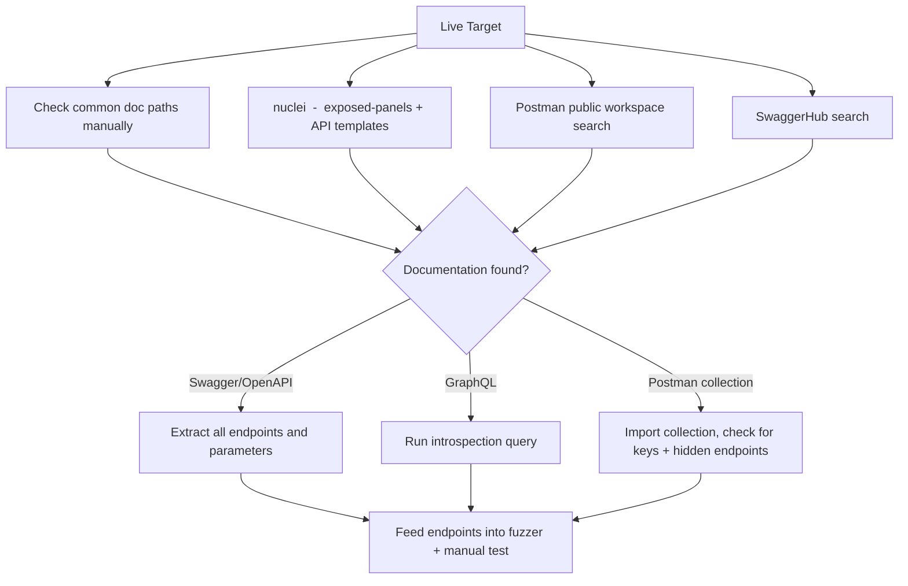

API documentation left exposed is a bug bounty gift: a complete list of every endpoint the server accepts, with parameter names, expected types, and sometimes example requests. You get the full attack surface handed to you without a single content-discovery wordlist. The documentation endpoints are often accessible in production because nobody thought to restrict them after development.

## Common Documentation Paths

These paths are worth checking on every target before running any wordlist.

# OpenAPI / Swagger
/swagger.json
/swagger-ui/
/swagger-ui/index.html
/swagger-ui.html
/api/swagger
/api/swagger.json
/openapi.json
/openapi.yaml
/openapi.yml
/v3/api-docs
/v3/api-docs.yaml
/v2/api-docs
/api-docs
/api/docs
 
# Spring Boot Actuator (often exposes mappings)
/actuator/mappings
/actuator
 
# Postman collections accidentally deployed
/postman.json
/collection.json
/api-collection.json
 
# GraphQL
/graphql
/graphiql
/playground
/gql
/api/graphql
/graphql/console
/v1/graphql
# Check the whole list in one shot
for path in \
  /swagger.json /swagger-ui/ /openapi.json /openapi.yaml \
  /v3/api-docs /v2/api-docs /api-docs /api/swagger.json \
  /graphql /graphiql /playground /actuator/mappings; do
  code=$(curl -sk -o /dev/null -w "%{http_code}" "https://target.com${path}")
  [ "$code" != "404" ] && [ "$code" != "000" ] && echo "$code $path"
done

Nuclei Detection Templates
Nuclei has templates for every common API doc endpoint.

# Run API documentation templates
nuclei -u https://target.com \
  -t http/exposed-panels/swagger-ui.yaml \
  -t http/exposed-panels/graphql-playground.yaml \
  -t http/exposures/apis/ \
  -silent \
  -o api_docs_found.txt
 
# Broader: all exposed panel templates
nuclei -l live_hosts.txt \
  -t http/exposed-panels/ \
  -tags swagger,openapi,graphql,api \
  -silent -o all_api_docs.txt

Postman Public Workspaces
Developers publish Postman collections to the public workspace, sometimes with real API keys still in them.

# Search Postman's public API
curl -s "https://www.postman.com/_api/ws/proxy?requestPath=/search/workspaces&q=target.com&type=all" | \
  jq -r '.data.workspaces[].name'
 
# Direct web search
# postman.com/search?q=target.com
# postman.com/search?q=api.target.com
 
# Interesting things to look for in a found collection:
# - Hardcoded Authorization headers
# - Environment variables with real values ({{api_key}} filled in)
# - Endpoints not in public documentation
# - Internal environment URLs
 
# Once you find a collection, export it
# Postman collection JSON contains every saved request

SwaggerHub
Companies publish API specs to SwaggerHub  -  sometimes before the API is locked down.

```
# Search SwaggerHub
curl -s "https://app.swaggerhub.com/apiproxy/registry/search?query=target&page=1&limit=10" | \
  jq -r '.apis[].properties[].url' 2>/dev/null
 
# Or web search
# site:app.swaggerhub.com target.com
# site:app.swaggerhub.com "Target Inc"
```

## What to Do With Found Documentation

```
# Download the spec
curl -sk https://target.com/v3/api-docs > openapi.json
 
# Parse all paths from OpenAPI spec
cat openapi.json | jq -r '.paths | keys[]' | sort -u
 
# Extract just POST endpoints (often more interesting than GET)
cat openapi.json | jq -r '.paths | to_entries[] | select(.value.post) | .key'
 
# Find parameters
cat openapi.json | jq -r '.paths | to_entries[] | "\(.key): \(.value | to_entries[].value.parameters?[]?.name // "")"' | \
  grep -v ": $" | head -30
 
# GraphQL  -  run introspection even if it says it's disabled
# Many targets disable introspection via middleware but forget the original handler
curl -s https://target.com/graphql \
  -H "Content-Type: application/json" \
  -d '{"query":"{ __schema { types { name } } }"}' | \
  jq '.data.__schema.types[].name'
```

## API Doc Workflow



## Related

- [Content Discovery](https://bugbounty.info/../Recon/Content-Discovery)  -  if standard paths miss, wordlist-based discovery finds docs
- [JavaScript Analysis](https://bugbounty.info/../Recon/JavaScript-Analysis)  -  API base URLs often appear in JS bundles before docs are public
- [Mobile App Recon](https://bugbounty.info/../Recon/Mobile-App-Recon)  -  mobile apps often reference API doc URLs directly


---

> 📖 **Source:** This page mirrors **[Griffin's Bug Bounty Playbook](https://bugbounty.info/)** (aussinfosec) — original writing and structure by Griffin, kept here for study.
