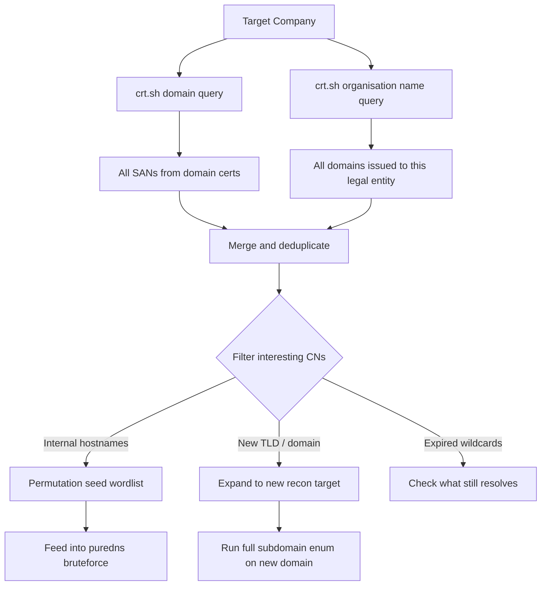

Every TLS certificate issued by a trusted CA gets logged to a public CT log before a browser will trust it. That log is permanent, searchable, and contains the full certificate metadata  -  including every SAN the cert was issued for. Companies regularly issue certificates for internal tooling, staging environments, and acquisition domains before they lock down DNS. The CT log captures all of it.

## Why CT Deserves Its Own Treatment

[Subdomain Enumeration](https://bugbounty.info/../Recon/Subdomain-Enumeration) touches CT as one source among many. This page goes deeper: cert pivoting by organisation name, chasing expired wildcard history, and finding internal-facing CN values that never map to public DNS. These techniques surface assets that no DNS-based tool will ever find.

## Basic CT Queries

### crt.sh  -  JSON API

# Standard wildcard query
curl -s "https://crt.sh/?q=%25.target.com&output=json" | \
  jq -r '.[].name_value' | \
  sed 's/\*\.//g' | \
  sort -u > ct_subs.txt
 
# Filter only unexpired certs
curl -s "https://crt.sh/?q=%25.target.com&output=json" | \
  jq -r '.[] | select(.not_after > now) | .name_value' | \
  sort -u > ct_active.txt
 
# Show CN and SANs together with issuance dates
curl -s "https://crt.sh/?q=%25.target.com&output=json" | \
  jq -r '.[] | [.common_name, .name_value, .not_before, .not_after] | @tsv' | \
  sort -t$'\t' -k3 > ct_dated.txt
certsh CLI
go install github.com/cemulus/certsh@latest
certsh -d target.com | sort -u > certsh_output.txt

Cert Pivoting by Organisation Name
This is the technique most hunters miss. Instead of querying by domain, query by organisation  -  the `O=` field in the certificate subject. Companies issue certs for domains they haven't linked publicly yet: new acquisitions, internal portals, beta products.

# crt.sh org query  -  use the exact legal entity name
curl -s "https://crt.sh/?o=Target+Inc&output=json" | \
  jq -r '.[].common_name' | sort -u
 
# Find all SANs across every cert issued to this org
curl -s "https://crt.sh/?o=Target+Inc&output=json" | \
  jq -r '.[].name_value' | \
  tr ',' '\n' | \
  sed 's/^ //; s/\*\.//g' | \
  grep -v '^$' | sort -u > org_cert_domains.txt
 
# Interesting output shape:
# target.com
# api.target.com
# internal-tools.target-corp.net   <-- different domain entirely
# staging.target-legacy.com        <-- old domain from before rebrand
Censys Cert Search
Censys indexes the same CT logs but with richer query syntax.

# Requires free Censys account
censys search "parsed.names: target.com" --index certificates | \
  jq -r '.[].parsed.names[]' | sort -u
 
# Query by org field
censys search 'parsed.subject.organization: "Target Inc"' --index certificates | \
  jq -r '.[].parsed.names[]' | sort -u
 
# Find certs with internal-looking SANs
censys search 'parsed.names: "*.corp.target.com"' --index certificates
Facebook CT API
Meta maintains their own CT log monitor with a clean API.

curl -s "https://developers.facebook.com/tools/ct/search/?domain=target.com" | \
  jq -r '.data[].cert_id'
 
# Broader  -  gets the full SAN list for each cert
curl -s "https://graph.facebook.com/v12.0/certificates?query=target.com&fields=domains,issuer_name,valid_from,valid_to&access_token=ANON_TOKEN" | \
  jq -r '.data[].domains[]' | sort -u

Mining Expired Wildcard Certificates
An expired wildcard `*.target.com` tells you the company used to issue a cert covering everything under a domain. They may have switched to per-subdomain certs  -  which means the old infrastructure under that wildcard is now covered piecemeal, and gaps exist.

# Find expired wildcards
curl -s "https://crt.sh/?q=%25.target.com&output=json" | \
  jq -r '.[] | select(.common_name | startswith("*")) | [.common_name, .not_after] | @tsv' | \
  sort -t$'\t' -k2 -r
 
# Output shape:
# *.internal.target.com   2019-03-14T00:00:00
# *.staging.target.com    2020-11-01T00:00:00
# *.target.com            2023-01-15T00:00:00
 
# Now check if those subdomains still resolve
echo "*.internal.target.com" | sed 's/\*\.//' | \
  while read domain; do
    dig +short A "$domain"
    subfinder -d "$domain" -silent
  done

Hunting Internal CN Values
Certificates for services that were never meant to be public sometimes appear in CT logs because the cert was issued by a public CA (misconfiguration). The CN field reveals internal naming schemes.

# Look for internal-looking CNs
curl -s "https://crt.sh/?q=%25.target.com&output=json" | \
  jq -r '.[].common_name' | \
  grep -E "(corp|internal|intranet|vpn|admin|mgmt|mgmt|ops|prod|staging|dev|uat|test|bastion)" | \
  sort -u
 
# Example output:
# *.corp.target.com
# vpn.internal.target.com
# bastion.ops.target.com
# mgmt-panel.admin.target.com
 
# These hostnames might not be externally resolvable  -  but they give you naming patterns
# Feed the patterns into permutation wordlists
echo "corp internal ops admin mgmt bastion" | tr ' ' '\n' > internal_keywords.txt

subfinder CT Sources
subfinder queries several CT-backed sources in one shot. Understanding which sources it's hitting helps you know when to supplement manually.

```
# subfinder with all sources enabled  -  includes crt.sh, certspotter, and others
subfinder -d target.com -all -silent -o subfinder_all.txt
 
# See which sources are active
subfinder -d target.com -ls 2>&1 | grep -i "cert\|ct\|certspotter"
 
# certspotter specifically  -  good for catching recent issuances
curl -s "https://api.certspotter.com/v1/issuances?domain=target.com&include_subdomains=true&expand=dns_names&expand=issuer&expand=cert" | \
  jq -r '.[].dns_names[]' | sort -u
```

## CT Workflow



## Related

- [Subdomain Enumeration](https://bugbounty.info/../Recon/Subdomain-Enumeration)  -  CT is one layer of a larger passive strategy
- [ASN Mapping](https://bugbounty.info/../Recon/ASN-Mapping)  -  org-name pivots often reveal related ASNs too
- [Acquisitions](https://bugbounty.info/../Recon/Acquisitions)  -  acquired companies' certs link back to the acquirer's org name
- [Shodan Censys Fofa](https://bugbounty.info/../Recon/Shodan-Censys-Fofa)  -  Censys indexes cert data alongside port scan results


---

> 📖 **Source:** This page mirrors **[Griffin's Bug Bounty Playbook](https://bugbounty.info/)** (aussinfosec) — original writing and structure by Griffin, kept here for study.
