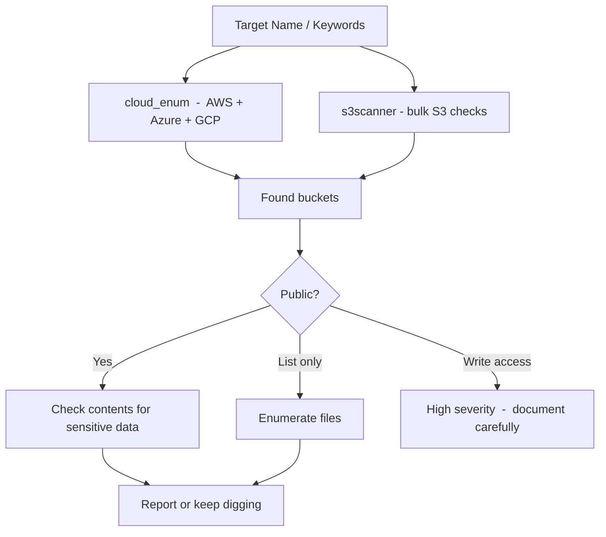

If your target is mid-to-large sized, some of their infra is in the cloud  -  and some of that cloud infra is misconfigured. The goal here is to map which cloud providers they're using and then hunt for exposed storage, forgotten buckets, and assets outside the scope of their primary domain.

## Mapping IPs to Cloud Providers

Cloud providers publish their IP ranges publicly. Once you have a list of resolved IPs, you can check which ones belong to AWS, Azure, GCP, etc.

# clouddetect  -  checks IP against known cloud ranges
pip install clouddetect
echo "1.2.3.4" | clouddetect
 
# Or do it yourself with provider JSON files
# AWS publishes theirs at:
curl -s https://ip-ranges.amazonaws.com/ip-ranges.json | jq -r '.prefixes[].ip_prefix'
 
# Azure:
# https://www.microsoft.com/en-us/download/details.aspx?id=56519
 
# GCP:
curl -s https://www.gstatic.com/ipranges/cloud.json | jq -r '.prefixes[].ipv4Prefix'
If you see their subdomains resolving into `*.amazonaws.com` CNAMEs, that's a direct tell.

# Find CNAME records pointing to cloud infra
cat live_hosts.txt | while read domain; do
  dig +short CNAME $domain
done | grep -E "(amazonaws|azure|storage\.google|blob\.core)"

S3 Bucket Enumeration
S3 buckets are named globally unique. If you know the company name, you can guess bucket names  -  and a surprising number are either public or misconfigured.

### cloud_enum

# Install
pip3 install cloud-enum
 
# Run against a target  -  hits AWS, Azure, GCP simultaneously
cloud_enum -k target -k targetcorp -k target-prod -k target-staging \
  --disable-azure --disable-gcp  # or leave them on
 
# With a keyword file
cloud_enum -kf keywords.txt
s3scanner
More focused on S3, faster for bulk checks.

go install github.com/sa7mon/s3scanner@latest
 
# Scan a list of bucket names
s3scanner scan --bucket-file buckets.txt
 
# Generate bucket name permutations
cat > buckets.txt << EOF
target
target-prod
target-dev
target-staging
target-backup
target-assets
target-data
target-logs
target-uploads
EOF
 
s3scanner scan --bucket-file buckets.txt
Manual S3 Checks
# Check if a bucket exists and is public
curl -s https://target-prod.s3.amazonaws.com/
 
# List bucket contents (if ACL allows it)
aws s3 ls s3://target-prod --no-sign-request
 
# Download everything from a public bucket
aws s3 sync s3://target-prod . --no-sign-request

Azure Blob Discovery
Azure blob storage follows predictable naming: `https://ACCOUNTNAME.blob.core.windows.net/CONTAINERNAME/`

# MicroBurst  -  Microsoft's own storage enumeration tool
Import-Module MicroBurst.psm1
Invoke-EnumerateAzureBlobs -Base target
 
# Or manual guessing
for name in target targetcorp target-prod target-backup; do
  curl -s "https://${name}.blob.core.windows.net/?comp=list" | grep -q "ContainerName" && echo "FOUND: $name"
done
 
# Check for public container listings
curl -s "https://target.blob.core.windows.net/public?restype=container&comp=list"

GCP Bucket Patterns
GCP bucket URLs follow `https://storage.googleapis.com/BUCKETNAME/` or `https://BUCKETNAME.storage.googleapis.com/`.

# gcpbucketbrute
python3 gcpbucketbrute.py -k target -u  # -u for unauthenticated checks
 
# Manual check
curl -s "https://storage.googleapis.com/target-prod"
curl -s "https://storage.googleapis.com/target-prod/?prefix=&delimiter=/"

Finding Cloud Assets Via DNS
Bucket names often surface in DNS  -  either as CNAMEs or in TXT records.

# Check if any subdomains CNAME to cloud storage
httpx -l all_subs.txt -silent -cdn | grep -E "(s3|blob\.core|storage\.google)"
 
# Look for cloud storage references in HTTP responses
katana -list live_hosts.txt -silent | grep -E "(s3\.amazonaws|blob\.core\.windows|storage\.googleapis)"

What You're Actually Looking For
Not every public bucket is a finding  -  plenty of companies intentionally host public assets from S3. What you want:

- Buckets with **write access** (upload a test file, delete it immediately)
- Buckets containing **credentials, config files, backups**
- Buckets with **PII**  -  user data, exports, logs
- **Subdomain takeover** via CNAME pointing to unclaimed bucket

```
# Test for write access
aws s3 cp test.txt s3://target-prod/test-bbhunter.txt --no-sign-request
# If it succeeds  -  that's your finding. Delete it immediately.
aws s3 rm s3://target-prod/test-bbhunter.txt --no-sign-request
```

## Cloud Asset Enumeration Flow



## Related

- [Subdomain Enumeration](https://bugbounty.info/../Recon/Subdomain-Enumeration)  -  CNAME records point you to cloud infra
- [GitHub Dorking](https://bugbounty.info/../Recon/GitHub-Dorking)  -  devs often commit bucket names and cloud credentials
- [Port Scanning](https://bugbounty.info/../Recon/Port-Scanning)  -  cloud IPs with open ports are fair game


---

> 📖 **Source:** This page mirrors **[Griffin's Bug Bounty Playbook](https://bugbounty.info/)** (aussinfosec) — original writing and structure by Griffin, kept here for study.
