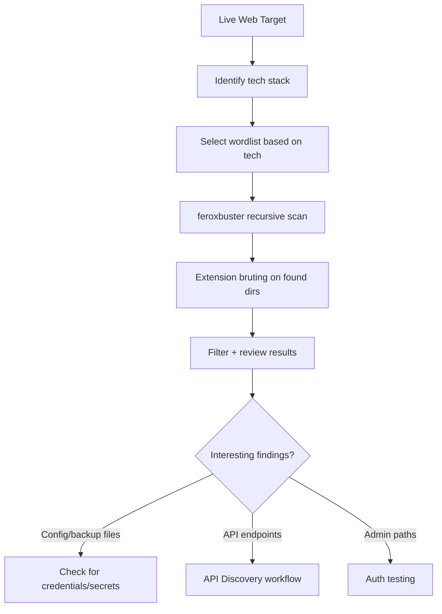

Content discovery is one of those areas where hunters spend 80% of their time tuning the wrong thing  -  they obsess over tools while using a mediocre wordlist. The wordlist matters more than the tool. A bad wordlist with ffuf is still a bad run.

## Tool Basics

### ffuf

Fast, flexible, battle-tested. My default for most cases.

# Basic directory scan
ffuf -u https://target.com/FUZZ \
  -w /opt/wordlists/web/raft-large-directories.txt \
  -mc 200,204,301,302,307,401,403 \
  -fc 404 \
  -t 50 \
  -o ffuf_dirs.json -of json
 
# With a Host header for vhost fuzzing
ffuf -u https://target.com/FUZZ \
  -w /opt/wordlists/web/raft-large-directories.txt \
  -H "Host: FUZZ.target.com" \
  -mc 200 -fs 1234
feroxbuster
Better default recursive behavior than ffuf  -  it'll auto-recurse into found directories without you having to set it up manually.

# Standard run with recursion
feroxbuster -u https://target.com \
  -w /opt/wordlists/web/raft-large-directories.txt \
  --status-codes 200,204,301,302,307,401,403 \
  --filter-status 404 \
  --threads 50 \
  --depth 3 \
  -o ferox_results.txt
 
# With extension bruting
feroxbuster -u https://target.com \
  -w /opt/wordlists/web/raft-large-files.txt \
  -x php,asp,aspx,jsp,json,xml,bak,config,env,log \
  --threads 50 \
  -o ferox_files.txt

Wordlist Selection  -  This Is What Actually Matters
Using a 5,000-word generic wordlist on a target that runs internal Java microservices will find nothing. Match your wordlist to the target tech.

| Wordlist | Source | Use Case |
|---|---|---|
| `raft-large-directories.txt` | SecLists | General directories  -  always run this |
| `raft-large-files.txt` | SecLists | File-level enumeration |
| `api/api-endpoints.txt` | SecLists | API path discovery |
| `combined_directories.txt` | Assetnote | Best general-purpose  -  larger |
| `httparchive_apiroutes_2023.txt` | Assetnote | API routes from HTTP Archive data |
| `spring-boot.txt` | SecLists | Spring Boot actuator endpoints |
| `tomcat.txt` | SecLists | Tomcat-specific paths |

# Get Assetnote wordlists  -  these are the best available
wget https://wordlists-cdn.assetnote.io/data/automated/httparchive_directories_1m_2023_06_28.txt
 
# Merge your own wordlist from historical findings
cat previous_targets_dirs.txt raft-large-directories.txt | sort -u > custom_combined.txt

Extension Bruting
Once you know the backend tech, extension bruting finds the interesting files.

# PHP app
ffuf -u https://target.com/FUZZ \
  -w /opt/wordlists/web/raft-large-files.txt \
  -e .php,.php5,.php7,.phtml,.bak,.old,.backup \
  -mc 200,301,302,403 -fc 404
 
# Java/Spring
ffuf -u https://target.com/FUZZ \
  -w /opt/wordlists/web/raft-large-files.txt \
  -e .java,.class,.war,.jar,.jsp,.jspx \
  -mc 200,301,302,403 -fc 404
 
# Config and credential files  -  always run this regardless of tech
ffuf -u https://target.com/FUZZ \
  -w /opt/wordlists/web/raft-large-files.txt \
  -e .env,.config,.conf,.cfg,.yml,.yaml,.json,.xml,.bak,.backup,.old,.log,.sql \
  -mc 200 -fc 404

Status Code Filtering Strategy
Blindly accepting 200s will flood you with false positives. Filter based on what you see the app returning.

# Calibrate first  -  send a request to a path that doesn't exist
curl -s -o /dev/null -w "%{http_code}" https://target.com/thispathshouldnotexist123
 
# If the app returns 200 for everything (soft 404), filter by response size
ffuf -u https://target.com/FUZZ \
  -w wordlist.txt \
  -mc 200 \
  -fs 1337  # filter out responses that are exactly this size (your 404 size)
 
# Auto-calibrate with feroxbuster
feroxbuster -u https://target.com -w wordlist.txt --auto-tune

Recursive Fuzzing
Finding a directory is just the start  -  you need to go deeper.

# feroxbuster handles recursion natively
feroxbuster -u https://target.com \
  -w /opt/wordlists/web/raft-medium-directories.txt \
  --depth 4 \
  --threads 40
 
# With ffuf, do it manually with a script
#!/bin/bash
ffuf -u https://target.com/FUZZ -w wordlist.txt -mc 200,301,302 -o round1.json -of json
# Extract found directories from JSON, then ffuf each one
jq -r '.results[] | select(.status==301 or .status==302) | .url' round1.json | \
  while read url; do
    ffuf -u ${url}/FUZZ -w wordlist.txt -mc 200,301,302 -o "round2_$(echo $url | md5sum | cut -c1-8).json" -of json
  done

High-Value Paths to Always Check Manually
Some paths are so commonly exposed that they're worth a manual check on every target.

```
for path in \
  /.git/config \
  /.env \
  /robots.txt \
  /sitemap.xml \
  /crossdomain.xml \
  /clientaccesspolicy.xml \
  /.well-known/security.txt \
  /api/swagger \
  /api/swagger.json \
  /api/openapi.json \
  /v1/swagger \
  /actuator \
  /actuator/env \
  /actuator/mappings \
  /phpinfo.php \
  /server-status \
  /server-info \
  /wp-admin \
  /wp-config.php.bak \
  /.DS_Store; do
  curl -s -o /dev/null -w "%{http_code} $path\n" "https://target.com$path"
done | grep -v "^404"
```

## Content Discovery Flow



## Related

- [API Discovery](https://bugbounty.info/../Recon/API-Discovery)  -  finding API docs and undocumented endpoints
- [Parameter Discovery](https://bugbounty.info/../Recon/Parameter-Discovery)  -  once you have paths, find hidden parameters
- [JavaScript Analysis](https://bugbounty.info/../Recon/JavaScript-Analysis)  -  JS files found during fuzzing often reveal more paths


---

> 📖 **Source:** This page mirrors **[Griffin's Bug Bounty Playbook](https://bugbounty.info/)** (aussinfosec) — original writing and structure by Griffin, kept here for study.
