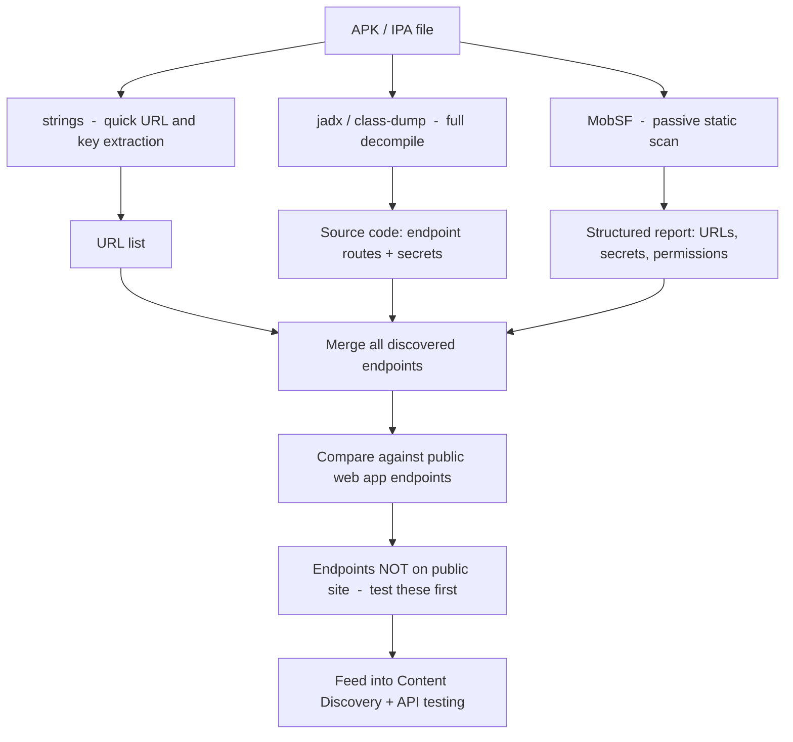

The mobile app is a compiled client that ships with hardcoded endpoints, API keys, deep link handlers, and feature flags that never appear in the web app. Most hunters ignore it. The ones who open the APK typically find a handful of endpoints that have never been tested  -  no rate limiting, no WAF, sometimes not even authentication checks  -  because the backend team assumed only the app would call them.

## APK Recon

### Getting the APK

# From a running Android device via ADB
adb shell pm list packages | grep target
# com.target.android
 
adb shell pm path com.target.android
# package:/data/app/com.target.android-1/base.apk
 
adb pull /data/app/com.target.android-1/base.apk target.apk
 
# Alternatively: apkeep pulls directly from Play Store
pip install apkeep
apkeep -a com.target.android target.apk
Decompiling with apktool
# Decompile to smali + resources
apktool d target.apk -o target_apktool/
 
# Interesting files to check immediately:
# target_apktool/AndroidManifest.xml  -  permissions, activities, deep links
# target_apktool/res/values/strings.xml  -  hardcoded strings, URLs, keys
# target_apktool/assets/  -  config files, certs, JS bundles
Decompiling with jadx
jadx produces readable Java from DEX bytecode  -  much easier to grep and read than smali.

# GUI (if available)
jadx-gui target.apk
 
# CLI  -  outputs Java source files
jadx target.apk -d target_jadx/
 
# Search the decompiled source for interesting patterns
grep -rn "api_key\|apikey\|secret\|password\|token\|Authorization" target_jadx/ | \
  grep -v "//\|* " | head -30
 
# Find all hardcoded URLs and hostnames
grep -rEn "https?://[a-zA-Z0-9._-]+" target_jadx/ | \
  grep -oE "https?://[a-zA-Z0-9._/-]+" | sort -u > jadx_urls.txt
 
# Find internal API endpoints
grep -rn "BuildConfig\|endpoint\|baseUrl\|BASE_URL" target_jadx/ | head -20

Extracting Endpoints and Secrets
# strings  -  quick and dirty, catches things jadx misses
strings target.apk | grep -E "https?://" | sort -u
 
# URL extraction with more context
strings target.apk | grep -E "(api|v1|v2|v3|internal|staging|prod)" | \
  grep -E "https?://" | sort -u > app_urls.txt
 
# Grep for common secret patterns
strings target.apk | grep -E \
  "(AKIA[0-9A-Z]{16}|ghp_[a-zA-Z0-9]{36}|eyJ[a-zA-Z0-9]+\.[a-zA-Z0-9]+\.[a-zA-Z0-9]+|AIza[0-9A-Za-z_-]{35})"
# AKIA...  -  AWS access key
# ghp_...  -  GitHub personal access token
# eyJ...   -  JWT
# AIza...  -  Google API key
 
# Deep link handlers  -  often underdocumented attack surface
grep -A 5 "intent-filter" target_apktool/AndroidManifest.xml | \
  grep -E "(scheme|host|pathPrefix)"

MobSF Passive Scan
MobSF does static analysis and returns a structured report without touching the app server.

# Start MobSF
docker run -it --rm -p 8000:8000 opensecurity/mobile-security-framework-mobsf:latest
 
# Upload and analyse via API
curl -F "file=@target.apk" http://localhost:8000/api/v1/upload \
  -H "Authorization: YOUR_MOBSF_API_KEY" | jq '.hash'
 
HASH="abc123..."
 
curl "http://localhost:8000/api/v1/scan" \
  -d "scan_type=apk&hash=${HASH}&re_scan=1" \
  -H "Authorization: YOUR_MOBSF_API_KEY"
 
# Download the JSON report
curl "http://localhost:8000/api/v1/report_json?hash=${HASH}" \
  -H "Authorization: YOUR_MOBSF_API_KEY" > mobsf_report.json
 
# Extract URLs and endpoints from the report
cat mobsf_report.json | jq -r '.urls[].url' | sort -u
cat mobsf_report.json | jq -r '.secrets[]' 2>/dev/null

IPA Recon (iOS)
Extracting the IPA
IPA files are ZIP archives. You need a decrypted IPA  -  either from a jailbroken device or from a service like AppStore dumps.

# Unzip the IPA
unzip target.ipa -d target_ipa/
 
# Find the binary
find target_ipa/ -name "*.app" -type d
# target_ipa/Payload/TargetApp.app/
 
BINARY="target_ipa/Payload/TargetApp.app/TargetApp"
Analysing the Binary
# strings on the binary
strings "$BINARY" | grep -E "https?://" | sort -u > ipa_urls.txt
 
# Check for hardcoded keys
strings "$BINARY" | grep -E "(AKIA|secret|api_key|password|token)" | head -20
 
# class-dump for Objective-C class/method names
class-dump "$BINARY" > class_dump.txt
grep -i "endpoint\|api\|request\|network" class_dump.txt | head -30
 
# Property list files  -  often contain configuration
find target_ipa/ -name "*.plist" | while read f; do
  echo "=== $f ==="
  plutil -p "$f" 2>/dev/null || strings "$f"
done | grep -iE "(url|endpoint|host|key|secret|token)"

Frida  -  Quick Dynamic Glance
Frida hooks running processes. Useful for seeing what API calls the app actually makes during normal use.

```
# Install frida-tools
pip install frida-tools
 
# List running apps on device
frida-ps -Ua
 
# Trace HTTP calls
frida-trace -U -n "TargetApp" \
  -m "-[NSURLSession dataTaskWithRequest:completionHandler:]" \
  -m "-[NSURLConnection sendSynchronousRequest:returningResponse:error:]"
 
# Intercept and dump outbound URLs (simple hook script)
frida -U -n "TargetApp" -e "
  var NSURLRequest = ObjC.classes.NSURLRequest;
  Interceptor.attach(NSURLRequest['- URL'].implementation, {
    onLeave: function(retval) {
      console.log('[URL] ' + ObjC.Object(retval).toString());
    }
  });
"
```

## Mobile App Recon Workflow



## Related

- [API Documentation Discovery](https://bugbounty.info/../Recon/API-Documentation-Discovery)  -  apps often reference Swagger/OpenAPI docs internally
- [JavaScript Analysis](https://bugbounty.info/../Recon/JavaScript-Analysis)  -  mobile web views contain JS with additional endpoints
- [GitHub Dorking](https://bugbounty.info/../Recon/GitHub-Dorking)  -  the mobile app's repo often contains the backend API source


---

> 📖 **Source:** This page mirrors **[Griffin's Bug Bounty Playbook](https://bugbounty.info/)** (aussinfosec) — original writing and structure by Griffin, kept here for study.
