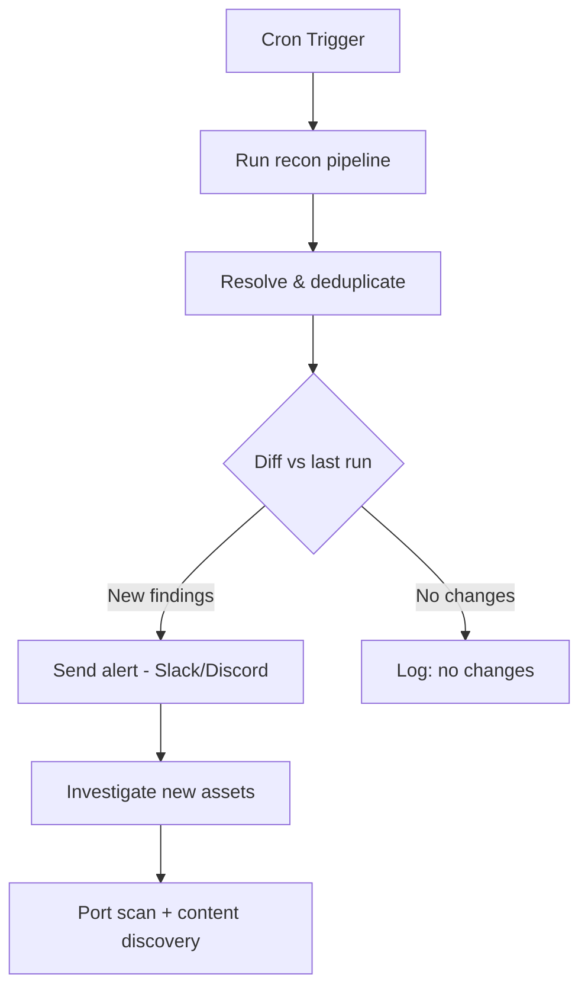

Point-in-time recon is almost useless on mature programs. Every hunter who joined before you already ran the same tools. The edge comes from being first  -  and being first means running continuous recon that alerts you when something new shows up. New subdomain = new asset = possibly never tested.

## The Core Idea

Run your recon pipeline on a schedule. Diff the output against the last run. Alert on new findings. Everything else is just implementation details.

## Directory Structure

Keep your monitoring organized. One folder per target, versioned output files.

~/recon/
  target.com/
    subs/
      2025-01-15.txt
      2025-01-16.txt
      latest.txt
    ports/
    urls/
    notify.sh
    run.sh

The Run Script
#!/bin/bash
# run.sh  -  drop this in ~/recon/target.com/
 
TARGET="target.com"
DATE=$(date +%Y-%m-%d)
RECON_DIR="$HOME/recon/$TARGET"
TODAY="$RECON_DIR/subs/$DATE.txt"
LATEST="$RECON_DIR/subs/latest.txt"
DIFF_FILE="$RECON_DIR/subs/diff_$DATE.txt"
RESOLVERS="$HOME/tools/resolvers.txt"
 
mkdir -p "$RECON_DIR/subs"
 
# Passive enumeration
subfinder -d $TARGET -silent -all -o /tmp/subfinder.txt 2>/dev/null
chaos -d $TARGET -silent -o /tmp/chaos.txt 2>/dev/null
curl -s "https://crt.sh/?q=%25.$TARGET&output=json" \
  | jq -r '.[].name_value' | sed 's/\*\.//g' \
  | sort -u > /tmp/crtsh.txt
 
# Merge
cat /tmp/subfinder.txt /tmp/chaos.txt /tmp/crtsh.txt \
  | sort -u > /tmp/merged.txt
 
# Resolve
puredns resolve /tmp/merged.txt -r $RESOLVERS -q > $TODAY
 
# Diff against last run
if [ -f "$LATEST" ]; then
  comm -23 <(sort $TODAY) <(sort $LATEST) > $DIFF_FILE
  NEW_COUNT=$(wc -l < $DIFF_FILE)
  if [ "$NEW_COUNT" -gt 0 ]; then
    bash "$RECON_DIR/notify.sh" "$DIFF_FILE" "$NEW_COUNT"
  fi
fi
 
# Update latest
cp $TODAY $LATEST

Diffing Results
# Manual diff between two runs
comm -23 <(sort new.txt) <(sort old.txt)
 
# Or with diff for context
diff old.txt new.txt | grep '^>'
 
# With a timestamp
comm -23 <(sort today.txt) <(sort yesterday.txt) | \
  while read sub; do echo "[$(date)] NEW: $sub"; done

Slack / Discord Alerts
The best setup is a webhook  -  new subdomains show up in a channel while you're doing other things.

### Slack Webhook

# notify.sh
#!/bin/bash
DIFF_FILE=$1
NEW_COUNT=$2
WEBHOOK="https://hooks.slack.com/services/YOUR/WEBHOOK/URL"
 
MESSAGE="*New subdomains found on target.com:* $NEW_COUNT new\n\`\`\`$(cat $DIFF_FILE)\`\`\`"
 
curl -s -X POST $WEBHOOK \
  -H 'Content-type: application/json' \
  --data "{\"text\":\"$MESSAGE\"}"
Discord Webhook
# Discord has a slightly different payload structure
curl -s -X POST "https://discord.com/api/webhooks/YOUR/WEBHOOK" \
  -H "Content-Type: application/json" \
  -d "{\"content\": \"**New subs on target.com:** \`\`\`$(cat $DIFF_FILE)\`\`\`\"}"
notify (ProjectDiscovery)
If you use multiple alert channels, notify abstracts this cleanly.

go install github.com/projectdiscovery/notify/cmd/notify@latest
 
# ~/.config/notify/provider-config.yaml  -  configure Slack, Discord, Telegram etc.
 
# Pipe new findings directly
cat diff.txt | notify -provider slack -id recon-alerts

Cron Setup
# Run daily at 6am
crontab -e
 
# Add:
0 6 * * * /bin/bash /home/user/recon/target.com/run.sh >> /home/user/recon/target.com/cron.log 2>&1
 
# Multiple targets  -  one cron per target, or loop
0 6 * * * for target in target1.com target2.com; do bash ~/recon/$target/run.sh; done

What to Monitor Beyond Subdomains
Subdomains are just the start.

| Signal | Tool | Why |
|---|---|---|
| New open ports | masscan diff | New service = new attack surface |
| New JS files | katana + diff | Changed JS often means new features |
| New URL paths | gau/waybackurls diff | Removed but still live endpoints |
| Certificate issuance | certstream | Real-time, before even DNS propagates |

### CertStream  -  Real-Time Cert Monitoring

```
pip3 install certstream
 
# Watch for certs matching your target
python3 - << 'EOF'
import certstream
import re
 
def callback(message, context):
    if message['message_type'] == 'certificate_update':
        domains = message['data']['leaf_cert']['all_domains']
        for domain in domains:
            if re.search(r'(target\.com|targetcorp)', domain):
                print(f"[NEW CERT] {domain}")
 
certstream.listen_for_events(callback, url='wss://certstream.calidog.io/')
EOF
```

## Monitoring Flow



## Related

- [Subdomain Enumeration](https://bugbounty.info/../Recon/Subdomain-Enumeration)  -  the pipeline you're automating
- [Port Scanning](https://bugbounty.info/../Recon/Port-Scanning)  -  follow up on new hosts automatically
- [Acquisitions](https://bugbounty.info/../Recon/Acquisitions)  -  company acquisitions bring in whole new asset sets


---

> 📖 **Source:** This page mirrors **[Griffin's Bug Bounty Playbook](https://bugbounty.info/)** (aussinfosec) — original writing and structure by Griffin, kept here for study.
