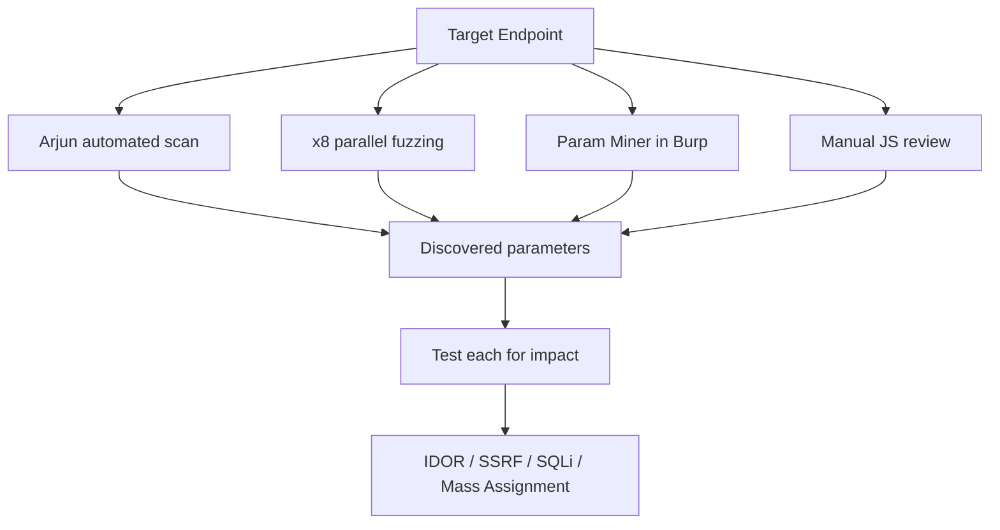

Hidden parameters are everywhere. Developers remove UI elements but not backend logic. Parameters get deprecated but the code path stays. Internal-only parameters get left in production. Finding these is consistently profitable  -  particularly for IDOR, SSRF, SQLi, and mass assignment vulnerabilities.

## Why Hidden Parameters Exist

- Old parameters kept for backwards compatibility
- Debug/internal parameters left in production (`debug=true`, `admin=1`)
- Feature flags (`beta=true`, `preview=1`)
- Parameters used by internal tools but not the frontend
- Mass assignment  -  the object has more fields than the form exposes

## Automated Discovery

### Arjun

Arjun sends a baseline request and then tests parameter names against the response, looking for changes in behavior.

# Basic run
arjun -u https://target.com/api/user
 
# With custom headers (for authenticated endpoints)
arjun -u https://target.com/api/user \
  -H "Authorization: Bearer YOUR_TOKEN" \
  -H "Cookie: session=abc123"
 
# POST endpoint
arjun -u https://target.com/api/update -m POST
 
# JSON body parameters
arjun -u https://target.com/api/user -m JSON
 
# Bulk from a file
arjun -i endpoints.txt --rate-limit 10 -o arjun_results.json
x8
x8 is faster than Arjun for large-scale work. Same concept  -  detects hidden parameters by looking for behavioral differences.

# GET parameters
x8 -u "https://target.com/page?FUZZ=test" \
  -w /opt/wordlists/parameters/params.txt
 
# POST body
x8 -u "https://target.com/api/update" \
  -X POST \
  -H "Content-Type: application/x-www-form-urlencoded" \
  -w /opt/wordlists/parameters/params.txt
 
# JSON
x8 -u "https://target.com/api/user" \
  -X POST \
  -H "Content-Type: application/json" \
  -w /opt/wordlists/parameters/params.txt \
  --json-type
Param Miner (Burp Extension)
Param Miner is the best option when you're already working in Burp. It mines cached parameter names from the request, JS, and the HTML, then fuzzes them. Right-click a request → Extensions → Param Miner → Guess params.

Useful Param Miner settings:

- Enable **"Add FCBZcookie"** to avoid poisoning production cache
- Set a concurrency limit
- Use **"Guess headers"** too  -  some apps behave differently with undocumented headers

## The Manual Approach: Reading JavaScript

Tools miss parameters that are only used in certain code paths. Manual JS review catches these.

# Download all JS files
katana -u https://target.com -jc -silent | grep "\.js$" | while read url; do
  filename=$(echo $url | md5sum | cut -c1-8).js
  curl -s "$url" -o "js_files/$filename"
done
 
# Find parameter names  -  look for fetch/axios/XMLHttpRequest calls
grep -hoE "(params|data|body)\s*=\s*\{[^}]+\}" js_files/*.js | head -50
 
# Look for parameter keys in objects
grep -oE '"[a-zA-Z_][a-zA-Z0-9_]{2,30}":\s' js_files/*.js | sort | uniq -c | sort -rn | head -50
 
# Find URL construction patterns
grep -oE 'FUZZ=[^&"'"'"'\s]+' js_files/*.js  # Replace FUZZ with param patterns
grep -oE '\?[a-zA-Z_]+=[^&"'"'"'\s]+' js_files/*.js | sort -u
Look specifically for:

- `fetch('/api/user?id=`  -  parameter names embedded in fetch calls
- `axios.post('/api/update', { id:`  -  JSON body keys
- `FormData.append('`  -  form parameters
- Object spread patterns like `{ ...defaults, debug: true }`

## Wordlist Sources for Parameters

Your wordlist matters. Generic wordlists miss technology-specific parameters.

# SecLists has a decent params list
/opt/SecLists/Discovery/Web-Content/burp-parameter-names.txt
 
# Assetnote HTTP archive-based parameter names  -  comprehensive
wget https://wordlists-cdn.assetnote.io/data/automated/httparchive_parameters_2023.txt
 
# Build your own from the target's own JS
grep -oE '[a-zA-Z_][a-zA-Z0-9_]{2,25}(?=\s*[=:])' js_files/*.js | \
  sort | uniq -c | sort -rn | awk '{print $2}' > target_params.txt

What to Do With Found Parameters
Finding a hidden parameter is step one. Step two is figuring out what it does.

# Test boolean parameters for behavior change
curl "https://target.com/api/user?debug=true"
curl "https://target.com/api/user?admin=1"
curl "https://target.com/api/user?internal=true"
 
# Test ID-type parameters with other user IDs (IDOR)
curl "https://target.com/api/profile?user_id=1337"
 
# Test with unexpected types
curl "https://target.com/api/search?limit=99999"
curl "https://target.com/api/search?limit=-1"
curl "https://target.com/api/search?limit[]=1&limit[]=2"  # Array injection

High-Value Parameters to Find
These are worth specifically hunting for:

| Parameter Pattern | Potential Vuln |
|---|---|
| `user_id`, `account_id`, `uid` | IDOR |
| `redirect`, `url`, `next`, `return_to` | Open redirect / SSRF |
| `file`, `path`, `include`, `template` | Path traversal / LFI |
| `callback`, `jsonp` | JSONP injection |
| `debug`, `test`, `admin`, `internal` | Privilege escalation |
| `format`, `output`, `content_type` | Response manipulation |
| `limit`, `offset`, `page`, `size` | DoS or data exposure |

## Parameter Discovery Flow

## Related

- [API Discovery](https://bugbounty.info/../Recon/API-Discovery)  -  API endpoints have the most hidden parameters
- [JavaScript Analysis](https://bugbounty.info/../Recon/JavaScript-Analysis)  -  the manual approach in more depth
- [Content Discovery](https://bugbounty.info/../Recon/Content-Discovery)  -  find the endpoints before you look for their params

---

> 📖 **Source:** This page mirrors **[Griffin's Bug Bounty Playbook](https://bugbounty.info/)** (aussinfosec) — original writing and structure by Griffin, kept here for study.
