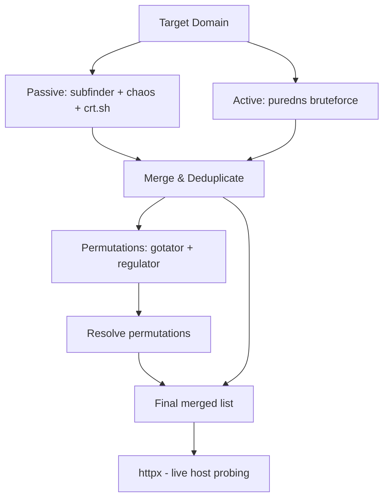

Subdomain enumeration is where programs get won or lost. Most hunters run one tool, grab 50 subdomains, and call it done. The ones cashing checks are combining five sources and finding the asset nobody else tested.

## Why One Source Isn't Enough

Every tool and service has a different dataset. crt.sh scrapes certificate transparency logs  -  it misses subdomains that were never issued a cert. SecurityTrails has historical DNS data  -  it finds things that are dead but point to something claimable. Brute-forcing catches things that were never in any public dataset. You need all of it.

## Passive Sources

### Certificate Transparency

# crt.sh  -  free, no API key, surprisingly good
curl -s "https://crt.sh/?q=%25.target.com&output=json" | jq -r '.[].name_value' | sed 's/\*\.//g' | sort -u
 
# Or use the subfinder wrapper which hits crt.sh and more
subfinder -d target.com -silent -all -o passive_subs.txt
SecurityTrails
# Needs an API key  -  the free tier is enough for recon
curl -s "https://api.securitytrails.com/v1/domain/target.com/subdomains" \
  -H "apikey: YOUR_KEY" | jq -r '.subdomains[]' | sed 's/$/.target.com/'
Chaos (ProjectDiscovery)
Chaos is a dataset of ~5M subdomains across bug bounty programs. If the target is in scope on a public program, this is often the fastest win.

# Install chaos-client
go install github.com/projectdiscovery/chaos-client/cmd/chaos@latest
 
chaos -d target.com -silent -o chaos_subs.txt
Other Passive Sources Worth Hitting

**Shodan**: `hostname:target.com`  -  finds infra-facing subdomains with open ports
**VirusTotal**: hits certificate and passive DNS
**DNSDumpster**: good UI for quick visual overview
**BBOT**  -  wraps a lot of this automatically

bbot -t target.com -f subdomain-enum -o bbot_output/

Active Bruteforcing
Passive sources give you what's been seen. Bruteforcing gives you what exists right now. The bottleneck is DNS resolver reliability  -  use verified resolvers or your results will be garbage.

### puredns

puredns mass-resolves against a clean resolver list and filters wildcard DNS  -  critical for not drowning in false positives.

# Get a fresh resolver list
wget https://raw.githubusercontent.com/trickest/resolvers/main/resolvers.txt
 
# Run puredns with a wordlist
puredns bruteforce /opt/wordlists/dns/combined.txt target.com \
  -r resolvers.txt \
  --resolvers-trusted resolvers-trusted.txt \
  -w puredns_results.txt
shuffledns
Good alternative, especially for chaining with massdns.

shuffledns -d target.com -w /opt/wordlists/dns/best-dns-wordlist.txt \
  -r resolvers.txt -o shuffledns_results.txt

Permutation & Alteration
Once you have a baseline list, permutations often find the most interesting assets  -  internal tooling, staging environments, region-specific deployments.

### gotator

gotator -sub passive_subs.txt -perm /opt/wordlists/dns/permutations.txt \
  -depth 1 -numbers 3 -md -silent | sort -u > permutations.txt
 
# Then resolve them
puredns resolve permutations.txt -r resolvers.txt -w resolved_permutations.txt
regulator
Regulator analyzes your existing subdomain list and generates statistically likely permutations based on naming patterns it finds.

python3 main.py -t target.com -f passive_subs.txt -o regulator_output.txt
puredns resolve regulator_output.txt -r resolvers.txt >> resolved_permutations.txt

Wordlist Recommendations
Tool quality matters less than wordlist quality. The hits come from the list.

| Wordlist | Where to Get It | Best For |
|---|---|---|
| `best-dns-wordlist.txt` | Trickest GitHub | General bruteforce |
| `subdomains-top1million-110000.txt` | SecLists | Fast first pass |
| `combined_subdomains.txt` | Jhaddix's list | Comprehensive sweep |
| `2m-subdomains.txt` | Assetnote | Deep coverage |

```
# Merge and deduplicate all your results
cat passive_subs.txt chaos_subs.txt puredns_results.txt resolved_permutations.txt \
  | sort -u | grep -v '^\*' > all_subs.txt
 
# Quick HTTP probe to see what's alive
httpx -l all_subs.txt -silent -o live_hosts.txt
```

## Workflow Summary



## Related

- [Monitoring](https://bugbounty.info/../Recon/Monitoring)  -  run this automatically and diff results over time
- [Port Scanning](https://bugbounty.info/../Recon/Port-Scanning)  -  what to do after you have a live host list
- [Cloud Range Discovery](https://bugbounty.info/../Recon/Cloud-Range-Discovery)  -  check if subdomains point to cloud infra
- [Wayback Mining](https://bugbounty.info/../Recon/Wayback-Mining)  -  historical subdomains from archive data


---

> 📖 **Source:** This page mirrors **[Griffin's Bug Bounty Playbook](https://bugbounty.info/)** (aussinfosec) — original writing and structure by Griffin, kept here for study.
