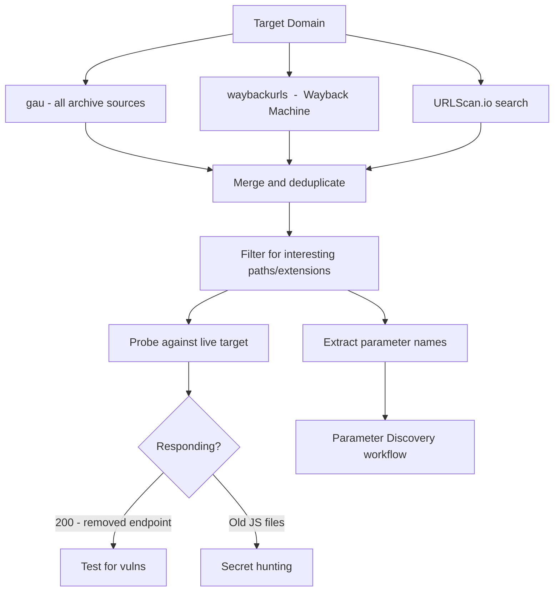

The Wayback Machine and similar URL archives are time machines for bug hunters. Endpoints get removed from the live site but the server-side code stays. Parameters get stripped from the frontend but the backend still accepts them. Old JS files sit on CDNs for years after the app "migrated away" from them. This stuff is gold.

## Why This Works

Apps deprecate features without removing the backend logic. A `/admin/export` endpoint that got "removed" 18 months ago might still respond with a 200 if you hit it. The URL just isn't linked anywhere anymore  -  until you find it in archive data.

## Core Tools

### waybackurls

Fetches URLs from the Wayback Machine's CDX API for a domain.

go install github.com/tomnomnom/waybackurls@latest
 
# Fetch all archived URLs for a domain
waybackurls target.com | tee wayback_urls.txt
 
# Include subdomains
cat subdomains.txt | waybackurls | tee wayback_all.txt
 
# Filter for interesting extensions
cat wayback_urls.txt | grep -E "\.(php|asp|aspx|jsp|json|xml|yaml|env|sql|bak|log|config)$"
gau (Get All URLs)
gau queries multiple sources  -  Wayback Machine, Common Crawl, URLScan, AlienVault OTX. More coverage than waybackurls alone.

go install github.com/lc/gau/v2/cmd/gau@latest
 
# Basic run
gau target.com | tee gau_urls.txt
 
# With subdomains
gau --subs target.com | tee gau_with_subs.txt
 
# Fetch from all providers
gau --providers wayback,commoncrawl,otx,urlscan target.com
 
# Filter out noise
gau target.com | grep -vE "\.(png|jpg|gif|svg|css|woff|woff2|ttf|ico)$" > gau_filtered.txt
Katana with Crawling
For live crawling combined with historical data:

# Crawl + extract URLs from JS
katana -u https://target.com -jc -d 5 -silent | tee katana_urls.txt
 
# Combine with historical
cat katana_urls.txt gau_filtered.txt wayback_urls.txt | sort -u > all_urls.txt

Finding Removed Endpoints That Still Work
The workflow: get archived URLs → filter for interesting patterns → probe them against the live site.

# Get all historical URLs
gau target.com | sort -u > historical_urls.txt
 
# Pull out paths (strip params for now)
cat historical_urls.txt | \
  python3 -c "
import sys
from urllib.parse import urlparse
seen = set()
for line in sys.stdin:
    url = line.strip()
    parsed = urlparse(url)
    path = parsed.path
    if path and path not in seen:
        seen.add(path)
        print(f'https://target.com{path}')
" > unique_paths.txt
 
# Probe them all
httpx -l unique_paths.txt -silent -status-code -content-length -o live_historical.txt
 
# What's responding with 200 that isn't on the current sitemap?
cat live_historical.txt | grep "^200"

Historical Parameter Discovery
Archived URLs often contain parameters that were used in old versions of the app.

# Extract parameter names from historical URLs
cat historical_urls.txt | \
  python3 -c "
import sys
from urllib.parse import urlparse, parse_qs
params = set()
for line in sys.stdin:
    parsed = urlparse(line.strip())
    for k in parse_qs(parsed.query).keys():
        params.add(k)
for p in sorted(params):
    print(p)
" > historical_params.txt
 
# Count them to see what was most common
cat historical_urls.txt | grep "?" | \
  grep -oE '[?&][a-zA-Z_][a-zA-Z0-9_]*=' | \
  sort | uniq -c | sort -rn | head -50
Then throw these parameter names at the current endpoints with [Parameter Discovery](https://bugbounty.info/../Recon/Parameter-Discovery) tools.

## Finding Old JS Files With Secrets

Old JS files on CDNs or still served by the app frequently contain API keys, internal endpoints, and debug code that got "removed" from the current version.

# Find all historical JS URLs
cat historical_urls.txt | grep "\.js$" | sort -u > historical_js.txt
 
# Probe which are still live
httpx -l historical_js.txt -silent -status-code | grep "200" | awk '{print $1}' > live_old_js.txt
 
# Download them and hunt for secrets
while read url; do
  echo "=== $url ==="
  curl -s "$url" | grep -E "(api_key|apiKey|secret|token|password|internal\.|192\.168|10\.\d+\.\d+)"
done < live_old_js.txt
Look specifically for:

- Hardcoded API keys
- Internal hostnames that aren't in your subdomain list
- Old API endpoints not in the current spec
- Feature flags with real values

## URLScan.io

URLScan is underused. It stores full page screenshots, DOM, and all network requests captured during crawls  -  including XHR requests to API endpoints.

# Search for your target's scanned pages
curl -s "https://urlscan.io/api/v1/search/?q=domain:target.com&size=100" | \
  jq -r '.results[].page.url' | sort -u
 
# Pull the DOM from a specific scan
curl -s "https://urlscan.io/dom/SCAN_UUID/" | grep -oE 'https://[^"'"'"']+' | sort -u
 
# Get network requests (API calls) from a scan
curl -s "https://urlscan.io/api/v1/result/SCAN_UUID/" | \
  jq -r '.data.requests[].request.url' | grep "api" | sort -u

Wayback CDX API Directly
Skip the tools when you want custom queries.

```
# CDX API  -  raw URL list
curl -s "http://web.archive.org/cdx/search/cdx?url=*.target.com/*&output=text&fl=original&collapse=urlkey&limit=50000" \
  > cdx_urls.txt
 
# Only specific status codes (e.g., 200s in the archive)
curl -s "http://web.archive.org/cdx/search/cdx?url=target.com/*&output=text&fl=original&filter=statuscode:200&collapse=urlkey" \
  > cdx_200s.txt
 
# Filter by mimetype  -  get only text responses (not images)
curl -s "http://web.archive.org/cdx/search/cdx?url=target.com/*&output=text&fl=original&filter=mimetype:text/html&collapse=urlkey" \
  > cdx_html.txt
```

## Wayback Mining Workflow



## Related

- [Parameter Discovery](https://bugbounty.info/../Recon/Parameter-Discovery)  -  historical params feed directly into this workflow
- [JavaScript Analysis](https://bugbounty.info/../Recon/JavaScript-Analysis)  -  deeper analysis of old JS files you find
- [GitHub Dorking](https://bugbounty.info/../Recon/GitHub-Dorking)  -  complementary historical source


---

> 📖 **Source:** This page mirrors **[Griffin's Bug Bounty Playbook](https://bugbounty.info/)** (aussinfosec) — original writing and structure by Griffin, kept here for study.
